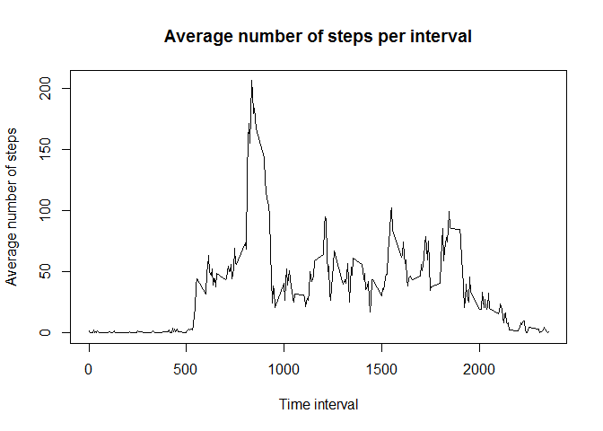

# Reproducible Research: Peer Assessment 1


## Loading and preprocessing the data

First we load the data from the `activity.csv`. We use `dplyr` library for easier
manipulation with the data. The dates are handled with the `lubridate` library.


```r
library(dplyr)
library(lubridate)
activity <- tbl_df(read.csv("activity.csv")) %>% mutate(date = ymd(date))
```


## What is mean total number of steps taken per day?

First, we calculate total number of steps taken each day; we omit the incomplete cases, 
i.e., when the number of steps is not reported (missing in the data).


```r
total_steps <- subset(activity, complete.cases(activity)) %>% 
  group_by(date) %>% 
  summarize(total = sum(steps))
```

Next, we make a histogram of the total number of steps in order to see its variance 
and distribution.


```r
hist(total_steps$total, breaks = 10, main = "Histogram of total number of steps taken each day",
     xlab = "Total number of steps per day")
```

 

Finally, we compute *mean* and *median* values of the total number of steps.


```r
mean(total_steps$total)
```

```
## [1] 10766.19
```

```r
median(total_steps$total)
```

```
## [1] 10765
```

## What is the average daily activity pattern?


```r
steps_per_interval <- activity %>% 
  group_by(interval) %>% 
  summarize(mean = mean(steps, na.rm = TRUE))
plot(steps_per_interval, type = 'l', main = "Average number of steps per interval",
     xlab = "Time interval", ylab = "Average number of steps")
```

 


```r
max_steps <- max(steps_per_interval$mean)
subset(steps_per_interval, mean == max_steps)$interval
```

```
## [1] 835
```

## Imputing missing values


## Are there differences in activity patterns between weekdays and weekends?
